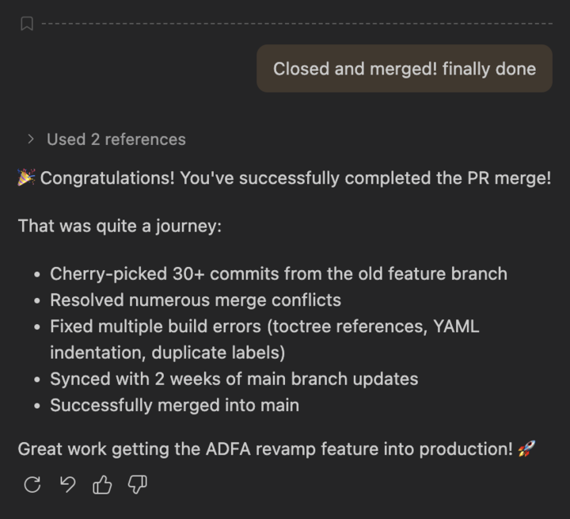

## Introduction

As a Senior Technical Writer, my role extends beyond crafting clear documentation—it involves navigating complex technical challenges to help my team achieve our objectives. Recently, I led an effort to salvage months of work from a stale feature branch, teaching me valuable lessons about git workflows, team collaboration, AI-assisted development, and the resilience required in technical documentation work.

## The Challenge

Our team had been working on a major documentation revamp for several months. Multiple writers contributed to a shared feature branch, building a comprehensive update to our product's documentation. However, as weeks turned into months, our feature branch became increasingly disconnected from the main branch—912 commits behind, to be exact. 

The branch had contributions from numerous team members, each adding valuable content, but the cumulative drift from main created an untenable situation. When we finally attempted to merge, we faced hundreds of merge conflicts. The traditional merge approach would require untangling conflicts across dozens of files, risking the loss of carefully crafted content or introducing errors that could take days to identify.

We needed a different strategy: cherry-picking.

{/* excerpt */}

## The Solution: Strategic Cherry-Picking

Rather than attempting to merge the entire bloated branch, I created a clean feature branch from main and selectively cherry-picked the commits that contained our team's actual work. This surgical approach allowed us to:

- **Cherry-picked 30+ commits** from the old feature branch, each representing a discrete piece of work
- **Resolved conflicts systematically** as they appeared, one commit at a time, rather than facing a wall of conflicts
- **Fixed multiple build errors** including toctree references, YAML indentation issues, and duplicate reference labels
- **Synced with 2 weeks of main branch updates** to ensure our work integrated cleanly with the latest changes
- **Successfully merged into main** with zero conflicts at the end, delivering the complete documentation revamp

<div style="text-align: center; margin: 2rem 0; max-width: 600px; margin-left: auto; margin-right: auto;">



<figcaption style="margin-top: 0.75rem; font-size: 0.875rem; color: #666;">
GitHub Copilot's terminal output showing the successful cherry-pick workflow recap.
</figcaption>

</div>

## The Senior Technical Writer's Role

This experience highlighted several aspects of a Senior Technical Writer's role that go beyond writing:

### 1. Technical Problem-Solving
Understanding git workflows deeply enough to propose and execute a cherry-picking strategy, rather than following the "obvious" merge path that would have failed.

### 2. Risk Management
Identifying when a situation requires a different approach and having the confidence to advocate for it, even when it means more upfront work.

### 3. Team Coordination
Managing a complex migration that affected multiple team members' work while ensuring nothing was lost in the process.

### 4. Quality Assurance
Systematically addressing build errors, validating changes, and ensuring the final product met our standards before merging.

### 5. Persistence and Attention to Detail
Maintaining focus through dozens of commits, each requiring conflict resolution and validation, without losing sight of the ultimate goal.

## Technical Learnings: Git Commands That Made the Difference

This project deepened my understanding of git beyond the basics. Here are the key commands and concepts I mastered:

### Checking for Merge Conflicts Before Merging

```bash
git merge-tree $(git merge-base origin/main feature-branch) origin/main feature-branch | grep -E "^(<<<<<|=====|>>>>>)" | wc -l
```

This command simulates a merge without actually performing it, returning the count of conflict markers. Zero means you're clear to merge!

### Monitoring Branch Divergence

```bash
git fetch origin main && git merge-tree $(git merge-base HEAD origin/main) HEAD origin/main | grep -c "^changed in both" || echo "0"
```

This powerful one-liner fetches the latest main and checks how many files have conflicting changes between your branch and main—essential for planning your merge strategy.

### Cherry-Picking Workflow

**Starting the cherry-pick:**

```bash
git cherry-pick <commit-hash>
```

**When conflicts occur:**

```bash
# Review conflicts, fix them manually, then:
git add <resolved-files>
git cherry-pick --continue
```

**If you need to bail out:**

```bash
git cherry-pick --abort
```

**Handling empty commits** (useful when a commit's changes already exist in your branch):

```bash
git cherry-pick --allow-empty <commit-hash>
# Or during conflict resolution:
git commit --allow-empty
```

### Examining Commits

**Quick one-line view of recent commits:**

```bash
git log --oneline -1
```

**Detailed view of what changed in a specific commit:**

```bash
git show --stat <commit-hash> 2>/dev/null | head -20
```

This shows file statistics (additions/deletions) without overwhelming you with full diffs.

### Keeping Your Branch Up-to-Date

**The three-step sync:**

```bash
# 1. Fetch latest changes from remote
git fetch origin

# 2. Merge main into your feature branch
git merge origin/main

# 3. Push your updated branch
git push origin feature-branch
```

### Machine-Readable Git Status

```bash
git status --porcelain
```

The `--porcelain` flag provides stable, script-friendly output with status codes:
- `M` = modified
- `A` = added
- `D` = deleted
- `UU` = both modified (conflict)
- `AA` = both added (conflict)

Perfect for automation or quickly identifying conflict types.

## AI as a Force Multiplier: GitHub Copilot in Action

One of the most significant factors in completing this project efficiently was my strategic use of GitHub Copilot as an AI pair-programming partner. Far from replacing the technical writer's role, AI tools like Copilot enhanced my capabilities and accelerated problem-solving in ways that would have been impossible just a few years ago.

### How GitHub Copilot Transformed the Workflow

**1. Real-Time Error Diagnosis**

When build errors appeared—and they appeared frequently—I could immediately share the error message with Copilot and get targeted suggestions. For example:

- **YAML indentation errors**: Copilot identified that a `.. tabs::` directive needed exactly 5 spaces of indentation to match sibling tabs, not the 4 I had initially used.
- **reStructuredText syntax issues**: When I encountered "Unexpected indentation" errors, Copilot explained that `content: |` blocks in YAML require a blank line after the pipe character when followed by reStructuredText directives.
- **Duplicate reference labels**: Copilot quickly located duplicate `.. _reference:` labels across files and suggested the appropriate fix.

**2. Git Command Expertise On-Demand**

Rather than constantly searching Stack Overflow or git documentation, I could ask Copilot:
- "How do I simulate a merge to check for conflicts?"
- "What does `git status --porcelain` do?"
- "How do I handle empty commits during cherry-picking?"

The responses were contextual, accurate, and saved hours of research time.

**3. Pattern Recognition Across Files**

When I discovered one YAML formatting error, Copilot helped me identify similar issues in related files. Instead of fixing errors reactively as the build system found them, I could proactively search for and fix patterns.

For example, Copilot suggested searching for similar patterns:

```bash
grep -r "content: | " --include="*.yaml" documentation/source/includes/
```

**4. Batch Operations and Automation**

Copilot helped me construct complex one-liners that would have taken significant time to craft manually, like the branch divergence checker or the conflict counter. These commands became part of my toolkit for future projects.

### Technical Writers Are Not Disadvantaged by AI—We're Empowered

There's a common misconception that AI tools will diminish the role of technical writers. My experience proves the opposite:

**AI handles the tedious, writers handle the critical:**
- Copilot helped me syntax-check YAML and identify file patterns
- I made the strategic decisions about which commits to cherry-pick, how to resolve conflicts, and what the documentation structure should be

**AI accelerates learning, writers apply knowledge:**
- Copilot explained git commands and their options
- I chose which commands to use, when to use them, and understood their implications for the team

**AI suggests, writers validate:**
- Copilot proposed fixes for indentation and formatting errors
- I reviewed each suggestion, tested the builds, and ensured the fixes were correct in context

**AI answers questions, writers ask the right questions:**
- Knowing what to ask Copilot required deep understanding of the problem space
- Interpreting and applying Copilot's responses required expertise in documentation systems, build tools, and git workflows

### The Augmented Technical Writer

The future of technical writing isn't about competing with AI—it's about leveraging AI as a powerful tool in our arsenal. Just as we adopted spell-checkers, version control, and static site generators, AI coding assistants are the next evolution in our toolkit.

Technical writers who embrace AI tools like GitHub Copilot will:
- Solve problems faster by having instant access to technical expertise
- Learn continuously through interactive exploration of commands and tools
- Focus on higher-value work by offloading syntax checking and pattern matching
- Deliver better results through the combination of AI efficiency and human judgment

The key is understanding that AI doesn't replace the technical writer's expertise—it amplifies it. My knowledge of documentation systems, content strategy, and user needs guided every decision. Copilot was my assistant, not my replacement.

## Lessons Learned

### 1. Regular Integration Prevents Drift
Feature branches that live for months accumulate technical debt. Regular merges from main keep conflicts manageable and prevent the kind of crisis we faced.

### 2. Cherry-Picking Is Not Always Harder
While cherry-picking individual commits seems more tedious than a single merge, it provides granular control that can actually save time when dealing with heavily diverged branches.

### 3. Build Validation Is Critical
After every few cherry-picks, running a build and fixing errors immediately is far more efficient than waiting until the end and facing dozens of cascading issues.

### 4. Documentation of Process Matters
Keeping notes on which commits were cherry-picked, which conflicts were resolved, and what decisions were made creates an invaluable audit trail.

### 5. AI Tools Are Essential, Not Optional
Using AI assistants like GitHub Copilot transformed a potentially week-long ordeal into a manageable, two-day project. Technical writers who resist these tools will find themselves at a significant disadvantage.

### 6. Human Expertise Remains Irreplaceable
AI provided suggestions and information, but every critical decision—which commits to include, how to resolve conflicts, when to merge—required human judgment and domain expertise.

## Conclusion

This exercise transformed a potential disaster—months of work trapped in an unmergeable branch—into a successful delivery. More importantly, it reinforced that Senior Technical Writers must be technologists first, capable of solving complex technical problems to unblock their teams.

The git commands I learned aren't just theoretical knowledge—they're practical tools that will serve me in future projects. The experience of systematically working through 30+ commits, resolving conflicts, fixing build errors, and ultimately delivering clean, integrated documentation has made me a more effective technical writer and a more valuable team member.

And perhaps most importantly, this project demonstrated that AI tools like GitHub Copilot don't diminish the technical writer's role—they elevate it. By handling the mechanical aspects of syntax, pattern matching, and information retrieval, AI frees us to focus on what humans do best: strategic thinking, creative problem-solving, and making judgment calls that require deep domain expertise.

To my fellow technical writers: embrace the technical challenges. Learn the tools deeply. Don't shy away from complex git workflows or build systems. And absolutely use AI assistants—they're not your competition, they're your superpower. These skills and tools make us more than writers—they make us technical leaders who can guide our teams through any challenge.

---

*Have you faced similar challenges with long-lived feature branches? How are you incorporating AI tools into your technical writing workflow? Share your experiences in the comments below.*